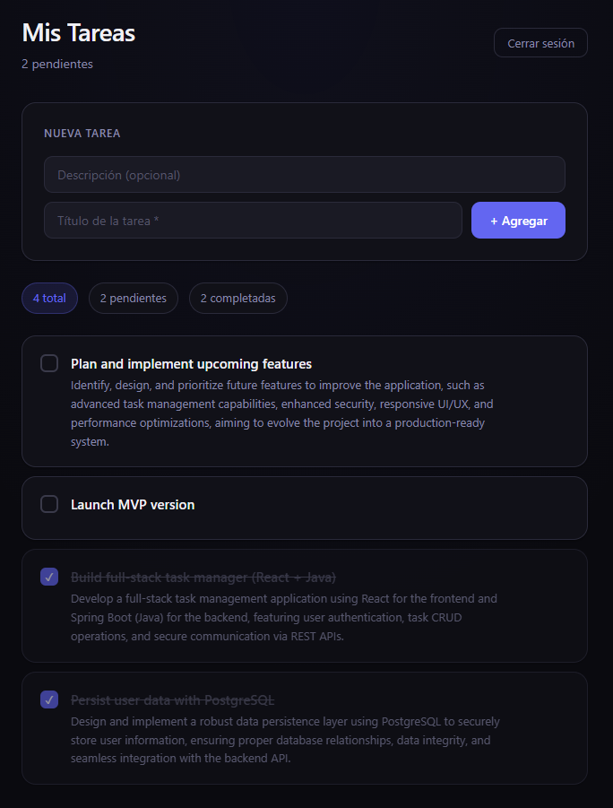

# TaskFlow — Task Manager App

Aplicación fullstack de gestión de tareas con autenticación JWT.
Permite a los usuarios registrarse, iniciar sesión y administrar sus tareas personales.



## ✨ Features

- Autenticación segura con JWT (registro, login, logout)
- CRUD completo de tareas (crear, leer, actualizar, eliminar)
- Marcar tareas como completadas
- Rutas protegidas en el frontend
- Manejo automático de token expirado
- Diseño dark mode responsivo

## 🛠 Tech Stack

**Backend**
- Java 21 + Spring Boot 4
- Spring Security + JWT (jjwt)
- Spring Data JPA + PostgreSQL
- Maven

**Frontend**
- React 19 + Vite
- React Router DOM
- CSS moderno con variables (sin librerías externas)

## 🚀 Cómo correr el proyecto localmente

### Requisitos previos
- Java 21
- Node.js 20+
- PostgreSQL corriendo localmente

### 1. Clonar el repositorio

```bash
git clone https://github.com/tu-usuario/task-manager-app.git
cd task-manager-app
```

### 2. Configurar el backend

Creá el archivo `backend/.env` con tus valores:

```env
DB_URL=jdbc:postgresql://localhost:5432/taskdb
DB_USERNAME=tu_usuario
DB_PASSWORD=tu_password
JWT_SECRET=un_secreto_de_al_menos_32_caracteres_aqui
JWT_EXPIRATION=3600000
```

Corré el backend:

```bash
cd backend
./mvnw spring-boot:run
```

El servidor arranca en `http://localhost:8080`

### 3. Configurar el frontend

```bash
cd frontend
npm install
npm run dev
```

La app arranca en `http://localhost:5173`

## 📁 Estructura del proyecto
```text
task-manager-app/
├── backend/
│   └── src/main/java/com/facundo/backend/
│       ├── config/          # Configuración de seguridad y CORS
│       ├── controller/      # Endpoints REST
│       ├── dto/             # Data Transfer Objects
│       ├── exception/       # Manejo global de errores
│       ├── model/           # Entidades JPA
│       ├── repository/      # Acceso a datos
│       ├── security/        # JWT Filter y Utils
│       └── service/         # Lógica de negocio
└── frontend/
    └── src/
        ├── components/      # Componentes reutilizables
        ├── context/         # Estado global (AuthContext)
        ├── pages/           # Vistas principales
        ├── routes/          # Configuración de navegación
        └── services/        # Llamadas a la API
```

## 🔐 Endpoints principales

| Método | Endpoint | Descripción | Auth |
|--------|----------|-------------|------|
| POST | `/users` | Registrar usuario | No |
| POST | `/users/login` | Iniciar sesión | No |
| GET | `/users/profile` | Perfil del usuario | Sí |
| GET | `/tasks` | Listar tareas (paginado) | Sí |
| POST | `/tasks` | Crear tarea | Sí |
| PUT | `/tasks/{id}` | Actualizar tarea | Sí |
| DELETE | `/tasks/{id}` | Eliminar tarea | Sí |

## 👤 Autor

**Facundo Alvarez Pérsico**
- GitHub: [@FacuAlvarezP](https://github.com/FacuAlvarezP)
- LinkedIn: [Facundo Alvarez Pérsico](https://linkedin.com/in/facundoalvarezp)
